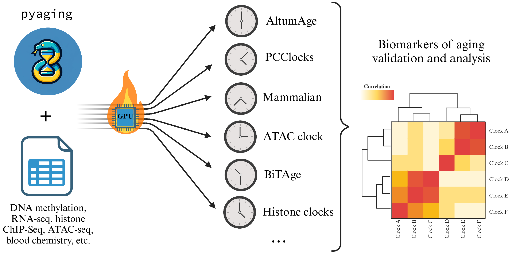

.. pyaging documentation master file, created by
   sphinx-quickstart on Sun Nov 19 17:35:20 2023.
   This file is the entry point to the pyaging package documentation.

.. raw:: html

   

.. raw:: html

   

.. image:: https://img.shields.io/badge/docs-latest-brightgreen.svg?style=flat
   :target: https://pyaging.readthedocs.io/en/latest/?badge=latest
   :alt: Documentation Status

.. image:: https://img.shields.io/pypi/v/pyaging.svg
   :target: https://pypi.python.org/pypi/pyaging
   :alt: PyPI version

.. image:: https://img.shields.io/github/license/lucascamillomd/pyaging.svg
   :target: https://github.com/lucascamillomd/pyaging/blob/main/LICENSE
   :alt: License

.. image:: https://img.shields.io/badge/DOI-10.1093%2Fbioinformatics%2Fbtae200-blue.svg
   :target: https://doi.org/10.1093/bioinformatics/btae200
   :alt: DOI

.. raw:: html

   

pyaging
=======

.. raw:: html

   

     
GPU-accelerated biological aging clocks in Python — 170+ published clocks across DNA methylation, histone marks, ATAC-seq, RNA-seq, and blood chemistry, behind a one-line prediction API.

   

.. grid:: 2 2 4 4
   :gutter: 3
   :class-container: sd-text-center

   .. grid-item-card:: :octicon:`rocket;1.5em;sd-text-primary` Get started
      :link: tutorials/tutorial_dnam_illumina_human_array
      :link-type: doc

      Install pyaging and run your first prediction — the Illumina 450K/EPIC walkthrough.

   .. grid-item-card:: :octicon:`telescope;1.5em;sd-text-primary` Clock Catalogue
      :link: clock_glossary
      :link-type: doc

      Filter, sort, and search every available clock.

   .. grid-item-card:: :octicon:`beaker;1.5em;sd-text-primary` Tutorials
      :link: tutorials/index
      :link-type: doc

      End-to-end walkthroughs for each data type.

   .. grid-item-card:: :octicon:`mark-github;1.5em;sd-text-primary` GitHub
      :link: https://github.com/lucascamillomd/pyaging

      Source, issues, and contributions.

Why pyaging
-----------

.. grid:: 1 1 3 3
   :gutter: 3

   .. grid-item-card:: 170+ clocks

      A comprehensive, curated collection of published aging clocks, each cross-validated against its source.

   .. grid-item-card:: Multi-omic

      DNA methylation, histone marks, ATAC-seq, RNA-seq, and blood chemistry — one consistent interface.

   .. grid-item-card:: GPU-optimized

      A PyTorch backend runs predictions on CPU or GPU with no code changes.

.. raw:: html

     

.. toctree::
   :hidden:
   :caption: Getting Started

   installation
   clock_glossary

.. toctree::
   :hidden:
   :caption: Tutorials

   tutorials/index

.. toctree::
   :hidden:
   :caption: API Reference

   pyaging

.. toctree::
   :hidden:
   :caption: Clock implementation

   clock_implementation
