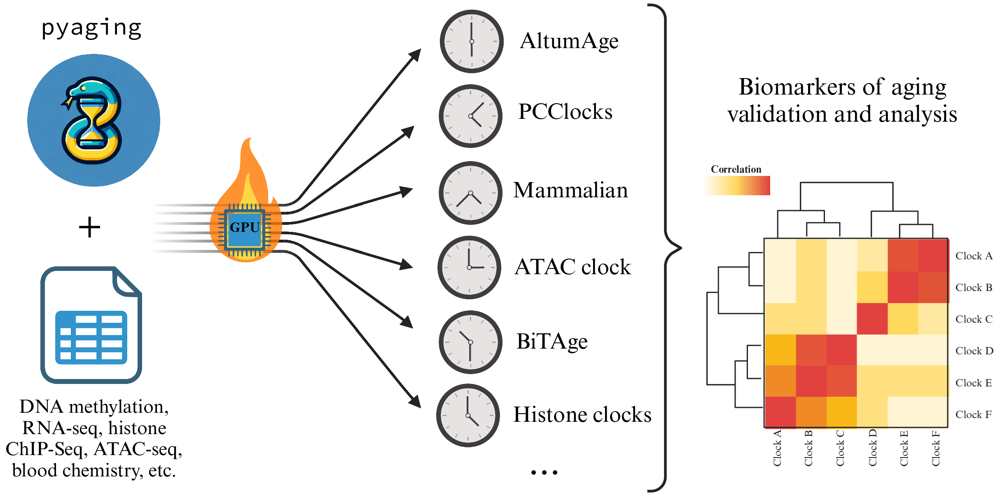

.. pyaging documentation master file, created by
   sphinx-quickstart on Sun Nov 19 17:35:20 2023.
   This file is the entry point to the pyaging package documentation.

:hide-toc: true

.. raw:: html

   

pyaging
=======

.. raw:: html

   

     
pyaging is a Python package for biological age prediction. It implements
     240 clocks and biomarkers spanning DNA methylation, histone marks, chromatin
     accessibility, transcriptomics (absolute and cohort-relative), proteomics, and blood
     chemistry, all through the same PyTorch-based interface.

     
<code>pip install pyaging</code>

     
240 clocks · 6 data types · PyTorch · MIT ·
     <a href="https://doi.org/10.1093/bioinformatics/btae200">Bioinformatics (2024)</a>

   

.. grid:: 2 2 4 4
   :gutter: 3
   :class-container: sd-text-center

   .. grid-item-card:: :octicon:`rocket;1.5em;sd-text-primary` Get started
      :link: tutorials/tutorial_dnam
      :link-type: doc

      Predict age from Illumina array data in a few lines.

   .. grid-item-card:: :octicon:`telescope;1.5em;sd-text-primary` Clock Catalogue
      :link: clock_glossary
      :link-type: doc

      Every clock, with metadata, references, and usage.

   .. grid-item-card:: :octicon:`beaker;1.5em;sd-text-primary` Tutorials
      :link: tutorials/index
      :link-type: doc

      One walkthrough per data type.

   .. grid-item-card:: :octicon:`mark-github;1.5em;sd-text-primary` GitHub
      :link: https://github.com/lucascamillomd/pyaging

      Source, issues, and contributions.

.. raw:: html

     

.. toctree::
   :hidden:
   :caption: Getting Started

   installation
   clock_glossary

.. toctree::
   :hidden:
   :caption: Tutorials
   :maxdepth: 1

   tutorials/tutorial_metadata
   tutorials/tutorial_cpgptgrimage3
   tutorials/tutorial_dnam
   tutorials/tutorial_histone_mark
   tutorials/tutorial_chromatin_accessibility
   tutorials/tutorial_transcriptomics
   tutorials/tutorial_proteomics
   tutorials/tutorial_blood_chemistry

.. toctree::
   :hidden:
   :caption: API Reference

   pyaging
